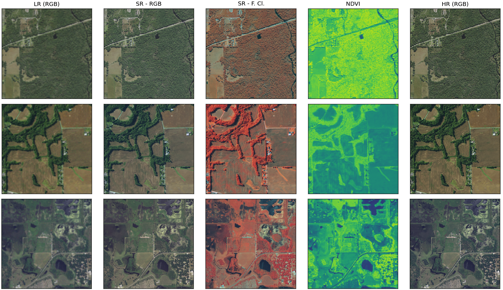

# Latent Diffusion Super-Resolution - Sentinel 2 (LDSR-S2)
This repository contains the code of the paper [Trustworthy Super-Resolution of Multispectral Sentinel-2 Imagery with Latent Diffusion](https://ieeexplore.ieee.org/abstract/document/10887321). In order to embed this model in your workflow, please check out [SuperS2](https://github.com/IPL-UV/supers2) under [Section 4 - Diffusion Model](https://github.com/IPL-UV/supers2?tab=readme-ov-file#4-diffusion-model) , which implements many SR models including this one and provides supplementary code

## Install and Usage
```bash
pip install opensr-model
```
```python
# Load the model --------------------------------------------------------------
device = "cuda" if torch.cuda.is_available() else "cpu"

# set the type of model, 4x10m or 6x20m
model_type = "10m"
assert model_type in ["10m","20m"], "model_type must be either 10m or 20m"

if model_type == "10m": # if 10m, create according model and load ckpt
    model = opensr_model.SRLatentDiffusion(bands=model_type,device=device) # 10m
    model.load_pretrained("opensr_10m_v4_v2.ckpt") # 10m

if model_type == "20m": # if 20m, create according model and load ckpt
    model = opensr_model.SRLatentDiffusion(bands=model_type,device=device) # 20m
    model.load_pretrained("opensr_20m_v1.ckpt") # 20m

# set model to eval mode
model = model.eval()

# test functionality of selected model --------------------------------------------
if model_type == "10m":
    X = torch.rand(1,4,128,128)
if model_type == "20m":
    X = torch.rand(1,6,128,128)
sr = model(X)
```

## Weights and Checkpoints
The model should load automatically with the moel.load_pretrained command. Alternatively, the checkpoints can be found on [HuggingFace](https://huggingface.co/simon-donike/RS-SR-LTDF/tree/main)

## Description
This package contains the latent-diffusion model to super-resolute 10 and 20m bands of Sentinel-2. This repository contains the bare model. It can be embedded in the "opensr-utils" package in order to be applied to Sentinel-2 Imagery. 
## Results Preview
Some example Sr scenes can be found as [super-resoluted tiffs](https://drive.google.com/drive/folders/1OBgYS6c8Kpe_JuGzWOQwOK6UYwhm-3Vh?usp=drive_link) on Doogle Drive. Scenes available:
- Buenos Aires, Argentina  
- Blue Mountains, Australia  
- Louisville, USA  
- Kutahya, Türkyie  
- Catalunya, Spain  



## Citation
If you use this model in your work, please cite  
```tex
@ARTICLE{10887321,
  author={Donike, Simon and Aybar, Cesar and Gomez-Chova, Luis and Kalaitzis, Freddie},
  journal={IEEE Journal of Selected Topics in Applied Earth Observations and Remote Sensing}, 
  title={Trustworthy Super-Resolution of Multispectral Sentinel-2 Imagery with Latent Diffusion}, 
  year={2025},
  volume={},
  number={},
  pages={1-14},
  keywords={Superresolution;Remote sensing;Training;Diffusion models;Measurement;Spatial resolution;Image reconstruction;Uncertainty;Adaptation models;European Space Agency;Super-Resolution;Remote Sensing;Sentinel-2;Deep Learning;Latent Diffusion;Model Uncertainty},
  doi={10.1109/JSTARS.2025.3542220}}
```


## Status
This is a work in progress and published explicitly as a research preview. This repository will leave the experimental stage with the publication of v1.0.0. 
[](https://pepy.tech/projects/opensr-model)
